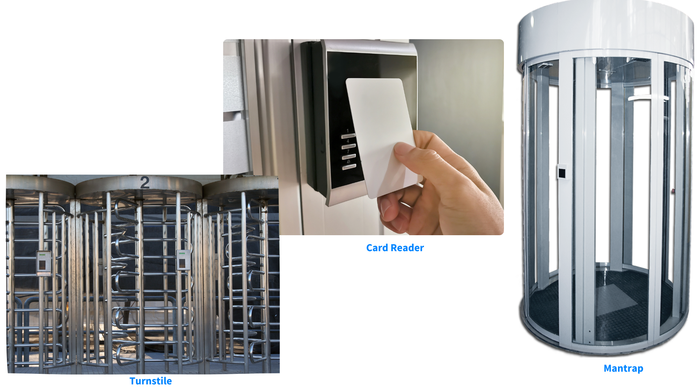

# Module 3 Understand Security Control

### What are security controls? (FIBS PUB 199)

Security controls pertain to the **physical**, **technical** and **administrative mechanisms** that act as **safeguards or countermeasures prescribed for an information system to protect the confidentiality**, **integrity** **and availability of the system and its information**. The implementation of controls should **reduce risk**, hopefully to an acceptable level.

* Physical control: it addresses process-based security needs using **physical hardware devices**, such as **badge readers**, **architectural features of buildings and facilities**, **and specific security actions to be taken by people**. They typically provide ways of controlling, directing or preventing the movement of people and equipment throughout a specific physical location, such as an office suite, factory or other facility. **Physical controls also provide protection and control over entry onto the land surrounding the buildings**, **parking lots or other areas that are within the organization’s control**. In most situations, physical controls are supported by technical controls as a means of incorporating them into an overall security system.

<figure><figcaption>
Examples of Physical Access Controls
</figcaption></figure>

* Technical control: it (also called logical controls) is security controls that **computer systems and networks directly implement**. These controls can provide automated protection from unauthorized access or misuse, facilitate detection of security violations and support security requirements for applications and data. Technical controls can be configuration settings or parameters stored as data, managed through a software graphical user interface (GUI), or they can be hardware settings done with switches, jumper plugs or other means. However, the implementation of technical controls always requires significant operational considerations and should be consistent with the management of security within the organization. Many of these will be examined in more depth as we look at them in later sections in this chapter and in subsequent chapters.
* Administrative control: it (also known as managerial controls) is **directives**, **guidelines** or **advisories aimed at the people within the organization**. They provide frameworks, constraints and standards for human behavior, and should cover the entire scope of the organization’s activities and its interactions with external parties and stakeholders. It is vitally important to realize that administrative controls **can and should be powerful, effective tools for achieving information security**. Even the simplest security awareness policies can be an effective control, if you can help the organization fully implement them through systematic training and practice. Many organizations are improving their overall security posture by integrating their administrative controls into the task-level activities and operational decision processes that their workforce uses throughout the day. This can be done by providing them as in-context ready reference and advisory resources, or by linking them directly into training activities. These and other techniques bring the policies to a more neutral level and away from the decision-making of only the senior executives. It also makes them immediate, useful and operational on a daily and per-task basis.

Some examples: Administrative: acceptable use policy, emergency operations procedures, employee awareness training Physical: Badge reader, stop sign in parking lot, door lock Technical: access control list
